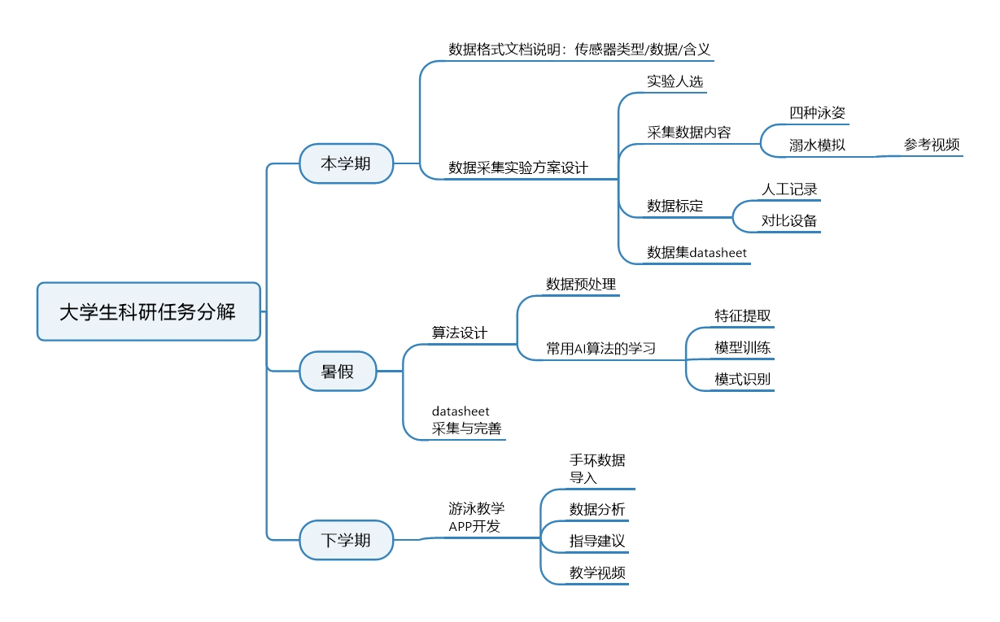

# **这个项目我们要通过传感器来收集数据,有选择的利用这些数据来进行分析,判断泳姿以及溺水**
进度计划图 
## 一:
>基础的学习,了解传感器的参数,物理含义   学会完全使用传感器,相关资料笔记记录在文件夹sensor中 

## 二:
>采集分析数据所必需的相关工具的学习过程存放在自己以名字命名的文件夹中   

## 三:
>项目文件暂存在文件夹Project中   

导入 git pull
提交 git commit -m "xx"
上传 git push
