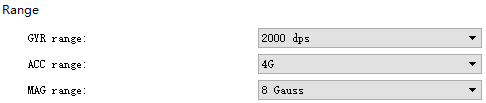
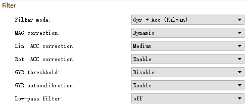
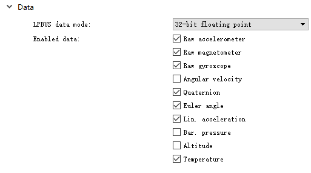

# 基础部分  

## 状态:  
### 命令模式(开机默认): 
> 蓝色LED以10Hz频率闪烁,可以通过命令传输测量数据,访问传感器的功能  
### 流模式  
> LED蓝/红淡入淡出,用于数据采集,无法设置传感器参数  

## 属性:  
> 采用右手笛卡尔坐标系 
>> 地磁北极方向为X轴正方向; 
>> 磁西为Y轴正方向; 
>> 向上为Z轴正方向(与重力方向相反); 
-----
>> 旋转：yaw(偏航)：绕Z轴360度旋转; 
>> pitch(俯仰)：绕Y轴左右各90度; 
>> roll(桶滚)：绕X轴360度旋转; 

>  
> =====

## 校准: 
### 陀螺仪校准  
> #### 1.自动校准 
>> 传感器处于无运动状态7.5秒后自动重新调整; 
>#### 2.手动校准 
>> 1.将传感器置于静止 
>> 2.通过固件命令或使用LpmsControl中的“Calibrate gyroscope”功能触发陀螺仪校准程序 
>> 3.等待大约30秒 
>> **(角速度有阈值限制,低于阈值将获取不到信息)** 
### 磁力计校准 
> 1.使用LpmsControl(Calibration  - > Calibrate mag.) 
> 2.按照校准向导的说明进行操作。 将传感器分别绕其偏航轴(Z),俯仰轴(Y),桶滚轴(X)旋转2-3圈 
> 3.随机旋转传感器，以便从不同方向尽可能多地获取数据。 
1.png) 

> 4.40秒后完成现场地图数据的收集。 然后计算地磁场矢量（局部地球磁场倾角）。 将传感器靠近校准位置，然后按校准向导中的“next”按钮。 
2.png) 

> 5.10秒后校准完成。
3.png) 

## 数据采集: 
### 范围  

> 陀螺仪范围(°/s) 
> 加速度范围(g) 
> 磁力计范围(gauss) 

### 过滤器  

>滤波模式:  
> 磁力校准方式  
> 线性加速度校准  
> 角加速度校准  
> 陀螺仪阈值开关 
> 陀螺仪自动校准  
> 低通滤波器  

### 参数栏  
  
> 在需要记录的数据后面打勾,从上至下依次为:  
>> 原始加速度计 
>> 原始磁力计 
>> 原始陀螺仪 
>> 角速度 
>> 四元数 
>> 欧拉角 
>> 线性加速度 
>> 大气压力 
>> 海拔 
>> 温度 

### 控制栏 
> 
>1开始测量 
>2开始记录数据 
>3 选择存放数据的文件 
> 
>1回放数据 
>2选择回放文件 
> 
>普通视图 
>方向图(四元数,欧拉角,线性加速度) 
>压力图(压力,海拔,温度) 
>3D可视化 
>磁场图 
