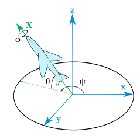

# 基础部分  

## 状态:  
### 命令模式(开机默认): 
> 蓝色LED以10Hz频率闪烁,可以通过命令传输测量数据,访问传感器的功能  

### 流模式  
> LED蓝/红淡入淡出,用于数据采集,无法设置传感器参数  

## 属性:  
> 右手笛卡尔坐标系 
>
> 地磁北极方向为X轴正方向; 
>
> 磁西为Y轴正方向; 
>
> 向上为Z轴正方向(与重力方向相反); 
> 旋转：yaw(偏航)：绕Z轴360度旋转; pitch(俯仰)：绕Y轴左右各90度; roll(桶滚)：绕X轴360度旋转; 
>
> 